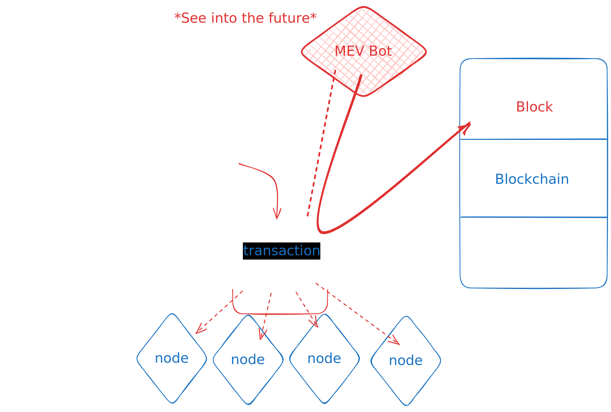

# MEV

[flash bots](https://docs.flashbots.net/)

- Low level info about blockchain

;

- User will send a transaction through some RPC url
- That RPC url will be pointing to some node
- That node will include the tx on the blockchain
- Whenever node receives a new tx, it dosen't include this in the blockchain right away
- each node has something called as `Mempool` aka memory pool
- This node will take the tx and add it to the mempool
- before adding it to the blockchain
- The reason it adds the transaction to mempool is
- All other nodes has access to this mempool
- and other nodes can verify the tx
- Once the tx is verified this tx will be put on the blockchain
- But we have a problem
- Since mempool is visible to all the other nodes
- There could be a malicious node
- which can see this tx
- Let's say this tx is about a raffle
- Raffle winner is called by the owner and according to the protocol whoever entered finally before calling selectWinner
- will be the winner of the raffle
- This MEV bots can see this tx and enter into the raffle
- then allow this tx to be added to the block
- Now this MEV bot will be the winner of the raffle
- This is called `front-running`